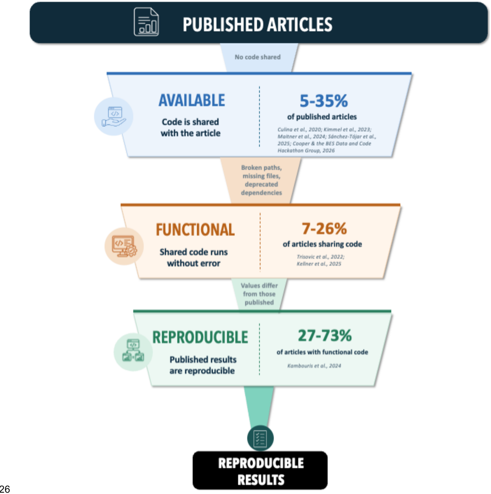
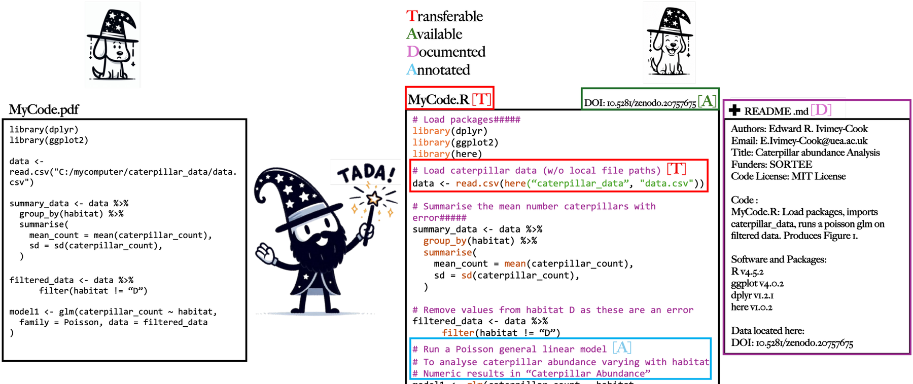

# TADA at a glance {#tada}

**T**ransferable, **A**vailable, **D**ocumented, **A**nnotated. Four steps that
take analytical code from a working copy on one machine to an archived record
that another researcher can run.

## Why another set of guidelines? {#tada-why}

There is plenty of advice on writing good code, but little of it covers
*archiving an analysis*. In the TADA paper ([Ivimey-Cook et al. 2025]{.tada-cite data-key="ivimey-cook-2025-tada"}) we identified four gaps in the existing resources:

1. They do not sufficiently address **how to archive analytical code**.
2. Few of them adhere to the **FAIR principles**.
3. They do not align with **journal requirements**.
4. They are complex and developed mainly for **software development**. Even
   **FAIR4RS** (the FAIR principles for Research Software;
   [Barker et al. 2022]{.tada-cite data-key="barker-2022"};
   [Chue Hong et al. 2022]{.tada-cite data-key="chue-hong-2022"}) is broad in
   scope and focused on software development, which may be part of why it
   has not been widely adopted outside that community.

The fourth gap depends on the difference between *analytical code* and *software*.

**Software** is written to be general, modular and tested, and to work across
systems with many different compatible datasets. Designing for that kind of
reuse is hard.

**Analytical code** is tailored to one dataset and one study. Its purpose is to
be a transparent, reproducible record of that analysis, not to become a tool for
other people.

Software standards therefore set too high a bar for analytical code, and researchers
faced with an unrealistic target tend to give up on it. 

TADA instead sets a **minimum standard** that anyone can meet, whatever their
coding experience, and helps coders archived code that is transparent and helps enable computational
reproducibility.

## The scale of the problem {#tada-problem}

All the figures below come from the TADA paper ([Ivimey-Cook et al. 2025]{.tada-cite data-key="ivimey-cook-2025-tada"}).

| What | Figure | Primary source |
|---|---|---|
| Journals in ecology & evolutionary biology with code-sharing policies | 15% in 2015, rising to **88% in 2024** | [Mislan et al. 2016]{.tada-cite data-key="mislan-2016"}; [Culina et al. 2020]{.tada-cite data-key="culina-2020"}; [Ivimey-Cook et al. 2025]{.tada-cite data-key="ivimey-cook-2025-policy"} |
| Articles in the field with open code | **5–35%**, depending on the study | [Culina et al. 2020]{.tada-cite data-key="culina-2020"}; [Kimmel et al. 2023]{.tada-cite data-key="kimmel-2023"}; [Maitner et al. 2024]{.tada-cite data-key="maitner-2024"}; [Kellner et al. 2025]{.tada-cite data-key="kellner-2025"}; [Sánchez-Tójar et al. 2025]{.tada-cite data-key="sanchez-tojar-2025"}; [Cooper & the BES Data and Code Hackathon Group 2026]{.tada-cite data-key="cooper-2026"} |
| Archived R files in Harvard Dataverse failing to run without error | **74%**, falling to 56% after automated cleaning | [Trisovic et al. 2022]{.tada-cite data-key="trisovic-2022"} |
| Scripts in species distribution and abundance papers that did not run, or ran with errors | **93%** | [Kellner et al. 2025]{.tada-cite data-key="kellner-2025"} |
| Meta-analyses computationally reproducible given working data and code | between **27%** (every result matching exactly) and **73%** (half of results within 10%) | [Kambouris et al. 2024]{.tada-cite data-key="kambouris-2024"} |

::: {.tada-figure}
{alt="Funnel diagram: published articles narrow to 5-35% with available code, then 7-26% of those are functional, then 27-73% of functional code is reproducible."}

<strong>The code-sharing cascade.</strong> Reproducible results depend on code that is available (shared with the article) and functional (runs without error). Figure 1 from [Ivimey-Cook et al.]{.tada-cite data-key="ivimey-cook-2025-tada"}

:::

Journal policy has changed a lot over the past decade, but practice has been
much slower to follow
([Ivimey-Cook et al. 2025]{.tada-cite data-key="ivimey-cook-2025-policy"}). Even
where code is present and functional, computational reproducibility is not always possible
([Kambouris et al. 2024]{.tada-cite data-key="kambouris-2024"}).

## The four principles {#tada-four}

Each has its own chapter. Here is each in a paragraph.

::: {.tada-cards}
::: {.tada-card .t}
[T]{.tada-letter} [Transferable](#transferable){.tada-word}
[Anyone can **open the file, view it and run it** without conversion or
alteration, on a different computer and a different operating system. Standard
file extensions, and no local file paths.]{.tada-gloss}
:::

::: {.tada-card .a1}
[A]{.tada-letter} [Available](#available){.tada-word}
[The code is **publicly archived** so that any external user has long-term
access to it, with a **globally unique persistent identifier** such as a DOI
that is cited in the manuscript.]{.tada-gloss}
:::

::: {.tada-card .d}
[D]{.tada-letter} [Documented](#documented){.tada-word}
[**Accurate, detailed metadata**, typically a README, describing the code files
and their usage: environment, versions, licence, where the data are, and what
runs in what order.]{.tada-gloss}
:::

::: {.tada-card .a2}
[A]{.tada-letter} [Annotated](#annotated){.tada-word}
[**Comments inside the code**, or code embedded in RMarkdown or Quarto alongside
descriptive text, explaining what each chunk does, why it is needed and where
its output appears in the paper.]{.tada-gloss}
:::
:::

Figure 2 below applies all four to a small piece of generic R code, showing the
same script before and after.

::: {.tada-figure}
{alt="Side-by-side comparison of a pre-TADA and post-TADA R script, showing coloured annotations for Transferable, Available, Documented and Annotated, alongside a README file."}

<strong>TADA applied to analytical code written in R.</strong> A pre-TADA script (left) and a post-TADA script (right); coloured letters mark which guideline each change addresses: Transferable (red), Available (green), Documented (purple), Annotated (blue). The code shown is generic, designed only to illustrate the guidelines. Figure 2 from [Ivimey-Cook et al.]{.tada-cite data-key="ivimey-cook-2025-tada"}

:::

## What TADA does not cover {#tada-scope}

We left three things out of the TADA's paper scope, although all three
support reproducible analyses ([Ivimey-Cook et al. 2025]{.tada-cite data-key="ivimey-cook-2025-tada"}) (if you fancy writing a section of the wiki on this, please get in touch!):

- **Dependency and environment managers** (`{renv}` in R, `{conda}` in Python),
  which help ensure the same computational environment is used each time, for
  example via a lockfile.
- **Containerisation** (Docker, Apptainer — formerly Singularity), which packages a complete software
  environment of programs and libraries into an image, so the environment
  itself is reproducible between systems. It is the standard answer to the
  "works on my computer" problem.
- **Workflow managers** (Snakemake, Nextflow), which specify the sequence of
  scripts or computational steps in a pipeline and their dependencies, so that
  each step executes in a defined, reproducible order.

None of these is a TADA requirement, but all three are worth knowing about.
See [Further reading](#further-reading).

## How TADA maps onto FAIR {#tada-fair}

TADA was built with the FAIR
([Wilkinson et al. 2016]{.tada-cite data-key="wilkinson-2016"}) and FAIR4RS
([Chue Hong et al. 2022]{.tada-cite data-key="chue-hong-2022"}) principles in
mind. Each letter maps onto one or more of them, and Transferable goes further on
purpose.

| FAIR principle | Definition | Covered by |
|---|---|---|
| **F**indable | Digital assets (metadata, data, code) can be easily found by both machines and humans | **Available**, through the provision of a unique identifier, and **Documented**, through the provision of rich metadata |
| **A**ccessible | Assets are retrievable via their identifier, with or without authorisation or authentication | **Available**, since the code is retrievable via that identifier |
| **I**nteroperable | Assets can interoperate with other assets, and are readable using standard documented formats | **Transferable**, *extended* to also mean runnable on different computers and operating systems |
| **R**eusable | Assets are described sufficiently to enable reuse and attribution, ideally via a licence | **Documented**, through a README and a licence, and **Annotated**, through commenting within the code itself |

::: {.tada-note}
All four rows come from the TADA paper, where we wrote that Transferable "corresponds to the FAIR principle of
interoperability... and extends it"; Available "corresponds to the FAIR
principles of both Findable... and Accessible"; Documented "corresponds to...
the FAIR principle of Reusable... and Findable (the provision of rich
metadata)"; and Annotated, "similar to documentation, corresponds to the FAIR
principle of Reusable... but rather than describing the code 'externally',
provides clear commenting within each coding script." Documented and Annotated
therefore share one FAIR principle (Reusable). The only difference is whether
the description sits outside the code (a README) or inside it (comments).
:::

**Transferable is broader than Interoperable.** Interoperability means anyone
can open and use your code. Transferability also requires that it *runs* on
someone else's machine and operating system, which is where hard-coded file
paths cause problems.

**Annotated has no FAIR principle of its own.** It shares Reusable with
Documented, because both help someone understand and reuse the code. They differ
in *where* the description lives: in a README (Documented) or in the code as
comments (Annotated). Annotated is the letter most specific to research code.
FAIR is mostly about machines finding and parsing assets, whereas annotation is
about a person being able to follow what the analysis did. 

::: {.tada-note}
"Reusable" has two senses. In the FAIR sense it
means sharing code so that it is clear what can be done with it, through a
licence and a README. In the software-development sense it means
writing generalised, modular, tested code that runs across systems and datasets.
TADA targets the first. If a guideline demands the second, check whether it was
written for software.
:::

## Languages {#tada-languages}

TADA is tailored mainly to **R and Python**, because these open-source
languages are widely used in ecology and evolutionary biology. The basic
principles also apply to workflow languages such as Snakemake, to compiled
languages such as C++, and to other disciplines.

Where a language does not save code in a standard file type, apply the
Transferable test: **can the resulting file be opened by a plain text editor?**
SPSS syntax `.sps` files, for instance, pass.

## Where to go next {#tada-next}

- Reading it for the first time: [Transferable](#transferable)
- Want the checklist, not the reasoning: [Start here](#quickstart-checklist)
- Preparing for a journal data editor: [The SORTEE guidelines](#sortee)
