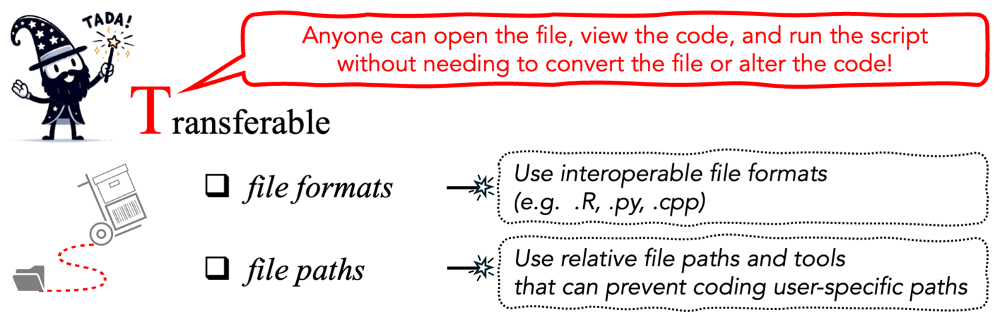

# [T]{.k-t} — Transferable {#transferable}

::: {.tada-key}
**Transferability** is the ability for anyone to open the file, view and run the
code **without conversion or alteration**. It covers the FAIR principle of
interoperability, meaning that anyone can open and use your code, and extends it
so that the code also runs on **different computers and operating systems**.
:::

::: {.tada-figure}
{alt="The TADA paper’s summary of advice on making analytical code Transferable."}

<p class="tada-figure-caption">Figure 3 from [Ivimey-Cook et al.]{.tada-cite data-key="ivimey-cook-2025-tada"}</p>
:::

Transferability has two requirements, and you need both.

1. The code is saved in a **file type any text editor or IDE can open**.
2. The code contains **no paths specific to your machine**.

## Save code in an interoperable file type {#transferable-filetype}

Save code with an extension that matches the language: **`.R`**, **`.py`**,
**`.cpp`**, or the equivalent standard format. These can be viewed, edited and
saved by any text editor or IDE (RStudio, VS Code, PyCharm) on any system.

**Do not share code inside `.PDF` or `.docx` files.** A PDF can be *viewed*, but
it cannot be opened and edited in an IDE without extra libraries or software, or
without first converting it to another file type.

::: {.tada-warn}
The bigger problem with PDFs and Word documents is copying code out of them.
Copy-pasting can change characters (apostrophes are the classic example), alter
white space, or bring in line numbers and headers. The code looks correct, so
the errors can be **hard to spot and slow to fix**.
:::

**A note on `.txt`.** A plain text file avoids those copy-and-paste problems, but
it has another. Many IDEs infer the language from the extension, so without
`.R` an IDE may not recognise the file as R and may refuse to run it until it
is re-saved. Use the language's own extension.

**If your language does not use a standard file type**, apply this test: *can
the resulting file be opened by a text editor?* SPSS syntax `.sps` files, for
example, can be read in a text editor, so they pass.

## Avoid local and user-specific file paths {#transferable-paths}

Local or absolute file paths are one of the most common reasons code that ran
for its author fails for everyone else (SORTEE Stage 5; [Pick et al. 2026]{.tada-cite data-key="pick-2026"}).

File paths must not depend on your local environment or directory structure, so
use **relative** paths rather than local or user-specific ones. Put **data, code
and all necessary materials in a single project directory**, since a relative
path has to be relative to something.

:::: {.tada-compare}
::: {.tada-before}
Before

```r
setwd("C:/Users/ed/Desktop/caterpillar_paper/analysis")
dat <- read.csv("caterpillars_2024.csv")
```

This sets a working directory that exists on one computer, with one operating
system, belonging to one person. Everyone else gets an error before the data
have loaded.
:::

::: {.tada-after}
After

```r
library(here)
dat <- read.csv(here("data", "raw", "caterpillars_2024.csv"))
```

This works on any operating system and wherever the project folder sits, so
anyone who downloads the project can load the data.
:::
::::

### How to do it {.unlisted .unnumbered}

There are several options, and you can combine them.

::: {.tabset}

#### R {.unlisted .unnumbered}

**Use an RStudio project.** *File → New Project* creates a `.Rproj` file. When you open
the project, RStudio sets the working directory to the project folder, so you
never need `setwd()`.
See <https://docs.posit.co/ide/user/ide/get-started/>.

**Use the `here` package** ([Müller & Bryan 2020]{.tada-cite data-key="muller-bryan-2020"}). `here()` builds paths relative
to the project directory, whatever the operating system:

```r
library(here)

raw     <- read.csv(here("data", "raw", "caterpillars_2024.csv"))
clean   <- here("data", "processed", "caterpillars_clean.csv")
figure  <- here("output", "figures", "fig3_abundance.png")
```

**Use both.** We recommend RStudio projects and `here` together, because they
make code most transferable across operating systems ([Ivimey-Cook et al. 2025]{.tada-cite data-key="ivimey-cook-2025-tada"}).

**Without an IDE**, launching R from inside the project directory does much the
same.

::: {.tada-warn}
Avoid `setwd()`. It sets a path specific to your operating system and your user
account, and absolute paths like this will almost certainly cause errors when
other people run your code on other systems.
:::

#### Python {.unlisted .unnumbered}

**Use `pyprojroot`** ([Chen 2023]{.tada-cite data-key="chen-2023"}), the Python counterpart to `here`, which builds
file paths relative to the project directory regardless of operating system:

```python
from pyprojroot import here
import pandas as pd

raw = pd.read_csv(here("data/raw/caterpillars_2024.csv"))
```

**Work inside the project directory.** If you run Python from within the
project folder, you do not need local file paths.

::: {.tada-warn}
Avoid `os.chdir()`, the Python equivalent of `setwd()`. It has the same problem:
it hard-codes a path that exists only on your machine.
:::

#### Other IDEs {.unlisted .unnumbered}

**VS Code.** Navigate to the project folder and open *the folder* rather than
the individual file. This works like an RStudio project: the
workspace root is the reference point for relative paths.

**Standalone interpreters.** Launching R or Python from within the project
directory does the same thing. The working directory is the project, so every
path in the code can be relative to it.

**Any language.** The principle is the same whatever the tool: put everything in
one project directory and write every path relative to the top of it.

:::

::: {.tada-note}
Whichever method you choose, **say so in the documentation**. Someone opening
your project needs to know they should open the `.Rproj` file, or activate a
virtual environment, before running anything. See
[Documented](#documented).
:::

## Beyond TADA: environments and pipelines {#transferable-beyond}

We left the following out of TADA's scope ([Ivimey-Cook et al. 2025]{.tada-cite data-key="ivimey-cook-2025-tada"}), but they are
worth knowing about because they fix failures that relative paths cannot.

**Dependency and environment managers**, such as **`{renv}`** ([Ushey & Wickham 2023]{.tada-cite data-key="ushey-2023"}) in R
and **`{conda}`** ([conda contributors 2026]{.tada-cite data-key="conda-2026"}) in Python, help make sure the same computational environment is
used each time a project is run, typically via a lockfile.

**Containerisation**, through **Docker** ([Merkel 2014]{.tada-cite data-key="merkel-2014"}) and **Apptainer**,
formerly called Singularity ([Kurtzer et al. 2017]{.tada-cite data-key="kurtzer-2017"}; [Apptainer n.d.]{.tada-cite data-key="apptainer"}), uses images that encapsulate a complete software
environment, including all required programs and libraries. This makes the environment reproducible between systems and avoids the common
*"works on my computer"* problem.

**Workflow managers**, such as **Snakemake** ([Köster & Rahmann 2012]{.tada-cite data-key="koster-2012"}) and
**Nextflow** ([Di Tommaso et al. 2017]{.tada-cite data-key="di-tommaso-2017"}), specify the sequence of scripts or
computational steps in a pipeline and their dependencies, so that each
step runs in a defined and reproducible order.

::: {.tada-wiki}
TADA does not require any of these. If you already use them, they strengthen
transferability, but relative paths and a good README get you most of the way
on their own.
:::

## Checklist {#transferable-checklist}

:::: {.tada-checklist-head}
::: {.tada-dog-float}
{.tada-dog-sad alt="A sad cartoon dog wearing a wizard hat"}
{.tada-dog-happy alt="A happy cartoon dog wearing a wizard hat"}
:::

::: {.tada-dog-hint}
Try doing all of these to make the dog happy.
:::
::::

- [ ] Every script has a standard extension for its language (`.R`, `.py`, `.cpp`, …)
- [ ] No code is distributed only inside a `.pdf` or `.docx`
- [ ] Data, code and materials are all inside a single project directory
- [ ] No `setwd()` (R) or `os.chdir()` (Python) anywhere in the code
- [ ] No absolute paths (`/Users/…`, `C:/…`, `~/Dropbox/…`)
- [ ] Paths are built with `here()` / `pyprojroot`, or are relative to the project root
- [ ] The project opens via `.Rproj` or a virtual environment, and this is stated in the README
- [ ] The project has been copied to a different folder, ideally on a different machine, and run successfully

**Next:** [Available](#available), on getting the code archived with a DOI.
