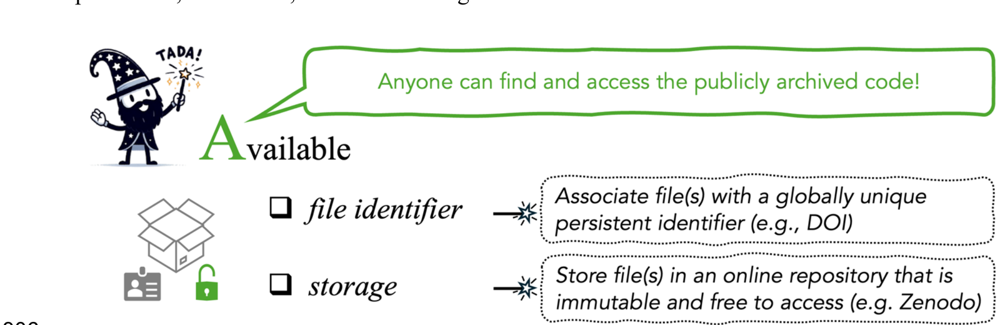

# [A]{.k-a1} — Available {#available}

::: {.tada-key}
**Availability** means **publicly archiving the code** so that anyone outside
the project has long-term access to it. It covers two FAIR principles:
**Findable**, through a unique identifier, and **Accessible**, because the code
can be retrieved via that identifier.
:::

::: {.tada-figure}
{alt="The TADA paper’s summary of advice on making analytical code Available."}

Figure 4 from [Ivimey-Cook et al.]{.tada-cite data-key="ivimey-cook-2025-tada"}

:::

There are two requirements:

1. The code has an associated **globally unique persistent identifier (PID)**,
   in practice a DOI.
2. That identifier is **cited in the corresponding manuscript**.

## Why GitHub is not an archive {#available-github}

GitHub is a good platform for *developing* code, with transparent version
control and easy collaboration. For archiving the code behind a published paper,
though, it fails on two counts:

- **It has no persistent identifier.** A GitHub URL is not a PID.
- **It is not immutable.** Files can be changed or deleted at any time,
  including after the manuscript is published. If the code behind a result is
  later edited or removed, that result can no longer be reproduced.

The same goes for similar platforms such as **Codeberg**, **Bitbucket** and
**GitLab**.

::: {.tada-tip}
You do not have to choose. **Develop on GitHub and archive on Zenodo.** Link
the repository to Zenodo and create a release on GitHub. Zenodo copies that
release and mints a DOI for it. See
<https://help.zenodo.org/docs/profile/linking-accounts/>.
:::

## Where to archive {#available-where}

You need a repository that is **immutable**, **free to access** and assigns a
DOI.

| Repository | PID | Immutable | Notes |
|---|---|---|---|
| **Zenodo** | DOI | [Yes]{.tada-yes} | Connects directly to a GitHub project. Gives a base project-level DOI as well as version-specific DOIs. You can choose the licence at deposit; CC-BY 4.0 is the default. |
| **Figshare** | DOI | [Yes]{.tada-yes} | General-purpose, and widely used for code and supplementary material. Assigns CC0 by default. |
| **Dryad** | DOI | [Yes]{.tada-yes} | Data-focused, and **mandates CC0**, which is not well suited to code (see [licences](#documented-licence)). Code uploaded to Dryad as software is published on Zenodo instead ([Lowenberg 2021]{.tada-cite data-key="lowenberg-2021"}). |
| **Dataverse** | DOI | [Yes]{.tada-yes} | General-purpose. Published versions are fixed: editing a published dataset creates a new draft version ([Dataverse Project n.d.]{.tada-cite data-key="dataverse-guide"}). |
| **Software Heritage** | SWHID | [Yes]{.tada-yes} | Preserves GitHub projects for long-term storage and provides PIDs as Software Hash Identifiers. |
| **OSF** | DOI | [No]{.tada-no} | Widely used, and supports anonymised links for double-blind review, but the SORTEE guidelines note that it **does not provide file immutability**, so projects and files can be changed or deleted ([Pick et al. 2026]{.tada-cite data-key="pick-2026"}). Fine for review, but archive elsewhere. |
| Domain repositories (e.g. **GenBank**) | Accession no. | [Yes]{.tada-yes} | For sequences and other domain-specific deposits. Other PID types include ARK, Handle and RRID. |
| GitHub / GitLab / Bitbucket / Codeberg | **None** | [No]{.tada-no} | Development platforms. Use for writing code, not for archiving it. |

::: {.tada-warn}
**Supplementary material is not archiving.** The SORTEE guidelines say that
data should not be provided only as supplementary material attached to the
article online, because it has no globally unique persistent identifier and may
not be open and accessible ([Pick et al. 2026]{.tada-cite data-key="pick-2026"}). The same goes for code. Everything must go in a public repository.
:::

::: {.tada-wiki}
**DOI versioning.** On Zenodo, every update to the code gets a new DOI, and a base project-level
DOI stays the same. Cite the **version-specific DOI** in your
paper, because that is the version your results came from. Give the
project-level DOI to someone who wants the latest version.
:::

## Cite the code in the manuscript {#available-cite}

Archiving is only half of the requirement. The PID must also be cited in the
manuscript, in the text and in the reference list, so the code can be found like
any other cited work. The [SORTEE guidelines](#sortee) require this for both data (Guideline 1.1) and code (Guideline 3.1;
[Pick et al. 2026]{.tada-cite data-key="pick-2026"}).

::: {.tada-wiki}
A worked example:

> **In the data availability statement.** All data and code needed to reproduce
> the analyses are archived on Zenodo:
> <https://doi.org/10.5281/zenodo.0000000>.
>
> **In the reference list.** Ivimey-Cook, E. R. (2026). *Code for: Caterpillar
> abundance varies with habitat* (v1.0.0) [Computer software]. Zenodo.
> <https://doi.org/10.5281/zenodo.0000000>
:::

## Data and code in the same place {#available-together}

The SORTEE guidelines recommend archiving code files **preferably in the same
archived project as the data files** (Guideline 3.1), which minimises problems
with computational reproducibility ([Pick et al. 2026]{.tada-cite data-key="pick-2026"}). A reader gets one deposit,
one DOI and one download, and the relative paths in your code keep working.

Sometimes this is not possible: some repositories treat data and code
differently, and Dryad's CC0-only licensing is a real constraint for code. In
that case, archive them separately and link them in **both** READMEs. See
[Documented](#documented).

## Consequences of not archiving {#available-wrong}

In the "pre-TADA" version of our worked example in the TADA paper, the code is not
archived and has no DOI, so there is no permanent, immutable, citable copy of
it ([Ivimey-Cook et al. 2025]{.tada-cite data-key="ivimey-cook-2025-tada"}). 

::: {.tada-wiki}
Two things follow. A reader who finds the paper cannot reliably find the code,
and if the working copy is edited or lost, the analysis behind the published
result cannot be recovered.
:::

## Sensitive data and embargoes {#available-sensitive}

Some data cannot be shared openly, including protected species locations,
personal data and third-party data held under licence. The SORTEE guidelines
allow for these cases and note that many repositories offer **embargoes** ([Pick et al. 2026]{.tada-cite data-key="pick-2026"}).

::: {.tada-wiki}
The exception normally applies to the **data**, not the **code**. Code that
cannot run without restricted data is still worth archiving openly, because it
documents exactly what was done.
:::

Describe the restriction, and how to get legitimate access, in both the data
availability statement and the README.

## Anonymising for double-blind review {#available-anonymous}

If your journal operates double-blind review, reviewers still need to see the
code. There are two options:

- **Submit anonymised data and code directly to the journal**, for example as a
  zip file.
- **Upload to a repository that supports anonymised review links**, such as
  Figshare, the Open Science Framework (OSF), GitHub, or Dryad, though Dryad may
  charge a deposit fee.

The README can also be anonymised during peer review to comply with
double-blind policies, then restored before archiving. See
[Documented](#documented-readme).

## Checklist {#available-checklist}

:::: {.tada-checklist-head}
::: {.tada-dog-float}
{.tada-dog-sad alt="A sad cartoon dog wearing a wizard hat"}
{.tada-dog-happy alt="A happy cartoon dog wearing a wizard hat"}
:::

::: {.tada-dog-hint}
Try doing all of these to make the dog happy.
:::
::::

- [ ] Code is deposited in an immutable, freely accessible repository
- [ ] The deposit has a globally unique persistent identifier (a DOI, or a SWHID)
- [ ] The version-specific DOI corresponds to the code that produced the published results
- [ ] The DOI is cited in the manuscript text **and** the reference list
- [ ] Data and code are in the same archived project where possible; where not, each README points to the other
- [ ] If developed on GitHub: a release was created and linked to Zenodo
- [ ] Any restricted data have a documented access route
- [ ] For double-blind review: an anonymised copy or anonymous link is available

**Next:** [Documented](#documented), on the README and the licence.
