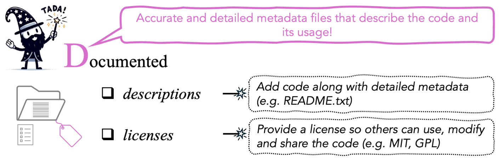

# [D]{.k-d} — Documented {#documented}

::: {.tada-key}
**Documentation** means providing **accurate and detailed metadata files that
describe the code files and how to use them**. In the TADA paper we map this
onto the FAIR principles of **Reusable** (assets described
sufficiently to enable reuse and attribution, ideally via a licence) and
**Findable** (through rich metadata). See
[How TADA maps onto FAIR](#tada-fair).
:::

::: {.tada-figure}
{alt="The TADA paper’s summary of advice on making analytical code Documented."}

<p class="tada-figure-caption">Figure 5 from [Ivimey-Cook et al.]{.tada-cite data-key="ivimey-cook-2025-tada"}</p>
:::

In practice, documentation means two files:

1. A **README**, in `.txt` or `.md`, describing the code and how to run it.
2. A **licence**, stating how others may use, modify and share the code.

Documentation holds information that annotation cannot. Comments in a script say
what a line does, but only the README can say which script to run first, which
version of R you need or where the data live.

## The README {#documented-readme}

You can provide a **combined README** covering both code and data metadata, or
**two separate READMEs**, one for code and one for data.

### What must be in it {.unlisted .unnumbered}

This comes from the "Documented How To" box and its accompanying text in the TADA
paper ([Ivimey-Cook et al. 2025]{.tada-cite data-key="ivimey-cook-2025-tada"}), with the package examples updated:

| Field | Detail |
|---|---|
| **Manuscript** | The title **and abstract** of the manuscript the code is associated with |
| **Authors & contact** | Authors, with an email address for correspondence. *May be anonymised during peer review* to adhere to double-blind policies |
| **Funders** | Any relevant funders |
| **Software** | Language and **version number**, e.g. R v4.3.3 |
| **Packages** | Important libraries or packages used, **with version numbers**, e.g. ggplot2 v3.5.1. Can also be supplied as a separate text file listing every loaded package and version, from `sessionInfo()` in R or `session_info` in Python (from the `session-info` package) |
| **Licence** | A mention of the code-specific licence |
| **Data location** | Where the relevant data are, ideally with a **PID** |
| **File contents** | What each file contains |
| **Run order** | The order in which the code should be run |
| **Runtime** | Whether the code takes a long time to run, especially for computing-intensive processes |
| **Inputs & outputs** | What data the code requires to run, and what data it produces, if any |

::: {.tada-wiki}
`sessionInfo()` (R) and `session_info.show()` (Python, from the `session-info`
package) list every loaded package and its version. Run it at the end of your final
analysis session, paste the output into a `session_info.txt` next to the README
and refer to it there. That one command answers most later questions about
software versions.
:::

### A worked README {.unlisted .unnumbered}

Below is a filled-in version of the fields above. The template is at
[`templates/README-template.md`](templates/README-template.md).

::: {.tada-wiki}
**Generate the README instead of writing it.** [READMEBuilder](https://github.com/EIvimeyCook/READMEBuilder), an R package with a built-in Shiny app, walks you through the fields above and writes a `README.md`. It covers project metadata, per-column data summaries, a directory map, script run order, detected package versions, and separate code and data licences. Install with `devtools::install_github("EIvimeyCook/READMEBuilder")`, then run `build_readme()`.
:::

````markdown
# Code for: Caterpillar abundance varies with woodland habitat type

Associated manuscript: Ivimey-Cook et al. (2026), *Journal of Example Ecology*.
Preprint: https://doi.org/10.00000/example

## Abstract
We tested whether caterpillar abundance differs between woodland habitat
types, using count data collected across three seasons. Abundance was higher
in mixed woodland than in conifer plantation after controlling for year
(Poisson GLM); we discuss implications for habitat management.

## Contact
Your Name — your.name@example.ac.uk
(Anonymised for peer review; restored on acceptance.)

## Funding
Example Research Council, grant ABC/123456/1.

## Data
Archived with this project. If archived separately:
https://doi.org/10.5061/dryad.000000 (`caterpillars_2024.csv`).

## Licence
MIT (see LICENSE). Data are released under CC0.

## Software environment
R v4.3.3. Full session details in `session_info.txt`.

Key packages:
  - here        v1.0.1   (relative file paths)
  - ggplot2     v3.5.1   (figures)

## How to run
Open `caterpillars.Rproj` in RStudio, then run the scripts in order:

  1. `R/01_clean_data.R`    reads data/raw/caterpillars_2024.csv
                            writes data/processed/caterpillars_clean.csv
  2. `R/02_fit_models.R`    fits the models reported in Table 2
                            writes output/models/*.rds   (~25 min)
  3. `R/03_make_figures.R`  produces Figures 2 and 3
                            writes output/figures/*.png

Total runtime approximately 30 minutes on a 2023 MacBook Pro. Script 02 is
the slow step; its outputs are saved so 03 can be re-run on its own.

## Files
  data/raw/         Unmodified field data. Never written to by any script.
  data/processed/   Generated by script 01. Safe to delete and regenerate.
  R/                Analysis scripts, numbered in run order.
  functions/        Helper functions sourced by the scripts.
  output/           Figures and saved model objects.
````

::: {.tada-note}
That README gives the total runtime, says which step is slow and whether its
output is cached, which script makes which figure, and that `data/processed/`
can be deleted and regenerated. A reader does not need to contact the author for
any of it.
:::

### The SORTEE view {.unlisted .unnumbered}

The [SORTEE guidelines](#sortee) ask for the same thing from the checking
side ([Pick et al. 2026]{.tada-cite data-key="pick-2026"}):

- **Guideline 1.5.** Detailed metadata, including but not limited to a README
  file, must accompany the **data**.
- **Guideline 3.5.** A sufficiently detailed README must accompany the **code**.
  The code must also be broken into sections with clear annotation stating the
  purpose of the code, with clear links to the relevant sections, figures and
  tables in the manuscript.

For code metadata, the question a data editor asks is whether a reader could
understand the analysis code without reading the manuscript. For data metadata,
it is the same question about the data files.

## The licence {#documented-licence}

::: {.tada-warn}
Code with **no licence** is not open code. Without one, others are legally
restricted from using, sharing or modifying what you archived, even though they
can see it ([GitHub Docs n.d.]{.tada-cite data-key="github-licensing"}).
Omitting a licence is a common documentation failure. The code is visible but
cannot lawfully be reused.
:::

The documentation must name a licence that says how others can use, modify and
share the code. Licences differ in whether attribution is required (whether you
must be cited), whether the code can be modified and whether it can be used
commercially.

### Choosing one {.unlisted .unnumbered}

::: {.tabset}

#### Permissive {.unlisted .unnumbered}

**MIT** is the standard example, with little or no restriction on use. Others
may copy, modify, merge, publish and share the code, provided the licence and
copyright notice travel with it
([choosealicense.com n.d.]{.tada-cite data-key="choosealicense"}).

::: {.tada-wiki}
Choose a permissive licence when you want the widest possible reuse and do not
mind what downstream users do with derivatives. That is the usual case for
analytical code that accompanies a paper.
:::

Other permissive options include **BSD 2-Clause**, **BSD 3-Clause**, and
**Apache 2.0**, which also grants patent rights explicitly
([choosealicense.com n.d.]{.tada-cite data-key="choosealicense"}).

#### Copyleft {.unlisted .unnumbered}

**GPL** licences are more restrictive and come with several conditions. Under
**GPL v3.0**, for example, derivative works must carry the same licence, and any
changes to the source code must be listed.

Choose a copyleft licence when you want derivatives to stay open. Some journals require a specific licence on archiving. The
**Journal of Statistical Software** requires a GPL.

#### Data licences {.unlisted .unnumbered}

Data and code are usually best licensed separately. Without a licence, data
**cannot be legally reused** in many circumstances, depending on jurisdiction.
Data usually take a **Creative Commons** licence (chooser:
<https://creativecommons.org/chooser/>).

| Licence | What it means | Notes |
|---|---|---|
| **CC0** | Public domain; no attribution required | The most permissive. Default at Figshare; **mandated by Dryad**. |
| **CC BY 4.0** | Reusers must credit the original author, but may distribute, remix, adapt and build upon the material, including commercially | Default at Zenodo. |
| **CC BY-NC 4.0** | As CC BY, but prohibits commercial use | More restrictive. |

**Dryad only supports CC0**, which suits data but is **not well suited to
code**. Code uploaded to Dryad as software is published on Zenodo instead
([Lowenberg 2021]{.tada-cite data-key="lowenberg-2021"}).

If your repository applies a single repository-wide licence, check whether it
suits *both* your data and your code before depositing them together.

#### How to attach it {.unlisted .unnumbered}

Either route works.

**Add a licence file.** Decide which licence fits your project using
<https://choosealicense.com/>, copy its text, and save it in your project next to
the code as a `LICENSE` file, the name GitHub looks for
([GitHub Docs n.d.]{.tada-cite data-key="github-licensing"}).

**Let the repository do it.** Some repositories, such as **Zenodo**, let you
choose the licence when you archive the code. It is then attached to the project
without you creating a file. Check what you select: repository defaults are
data licences (CC BY 4.0 at Zenodo, CC0 at Figshare), so pick a code licence
such as MIT for the code.

:::

### Questions that determine the choice {.unlisted .unnumbered}

In the TADA paper ([Ivimey-Cook et al. 2025]{.tada-cite data-key="ivimey-cook-2025-tada"}) we set out the questions that should decide the
choice:

- **Who is the audience?** Is the code intended for commercial applications?
- **Do you want others to be able to modify or extend it?**
- **What do your journal, institution and funder require?** Some journals
  mandate a specific licence on archiving.
- **Does your repository already impose a licence?** Dryad's CC0-only policy is
  the case to watch for.

::: {.tada-note}
The SORTEE guidelines require a licence for both data (Guideline 1.2) and code
(Guideline 3.2; [Pick et al. 2026]{.tada-cite data-key="pick-2026"}), but they treat the two differently. For **data** they
**do not recommend or enforce any specific type**, so you only have to choose
and state one. For **code** they state a preference: *"We suggest using permissive code licences whenever
possible, for example, MIT, BSD 2-Clause, GNU, and Apache"* (Guideline 3.2).
:::

## Checklist {#documented-checklist}

:::: {.tada-checklist-head}
::: {.tada-dog-float}
{.tada-dog-sad alt="A sad cartoon dog wearing a wizard hat"}
{.tada-dog-happy alt="A happy cartoon dog wearing a wizard hat"}
:::

::: {.tada-dog-hint}
Try doing all of these to make the dog happy.
:::
::::

- [ ] A README (`.md` or `.txt`) is at the top level of the archived project
- [ ] It names the manuscript, authors, contact email, and funders
- [ ] It states software and version, and key packages with versions
- [ ] A full environment dump (`sessionInfo()` / `session_info`) is included or referenced
- [ ] It states where the data are, with a PID if archived separately
- [ ] It describes what each file contains
- [ ] It gives the run order
- [ ] It flags anything slow or computationally intensive
- [ ] It states what the code needs as input and what it produces
- [ ] A licence is chosen, stated in the README, and attached (file or repository setting)
- [ ] Data and code licences are each appropriate to what they cover
- [ ] For double-blind review, an anonymised version of the README exists

**Next:** [Annotated](#annotated), on comments inside the code.
