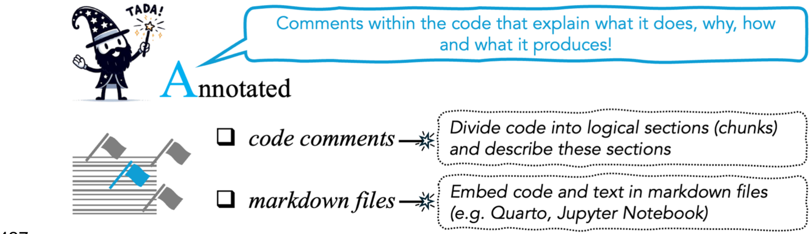

# [A]{.k-a2} — Annotated {#annotated}

::: {.tada-key}
**Annotation** means adding comments **within each code file** (with `#` in R and
Python), or embedding code in an **RMarkdown or Quarto** document alongside
descriptive text. It helps a reader both *understand* your archived code
(transparency) and *run* it (functionality and reproducibility).
:::

::: {.tada-figure}
{alt="The TADA paper’s summary of advice on making analytical code Annotated."}

<p class="tada-figure-caption">Figure 6 from [Ivimey-Cook et al.]{.tada-cite data-key="ivimey-cook-2025-tada"}</p>
:::

Annotation, like Documentation, corresponds to the FAIR principle of Reusable.
As we put it in the TADA paper, it does the same job "but rather than describing the code
'externally', provides clear commenting within each coding script"
([Ivimey-Cook et al. 2025]{.tada-cite data-key="ivimey-cook-2025-tada"}).

## Script headers {#annotated-header}

Before annotating chunks, we recommend a **script header**: a short block at the
top of the file saying what the whole script does and what it produces.

```r
##### Caterpillar abundance analysis #####
# Fits Poisson GLMs of caterpillar counts against habitat and year, and
# produces the coefficients and figures reported in Table 2 and Figure 3
# of the manuscript. Run after 01_clean_data.R.
```

A header answers "what is this file for?" in a few lines, before the reader
reaches the first chunk.

## Annotate chunks, not lines {#annotated-chunks}

**Annotate code chunks, not every line.** Line-by-line annotation is possible,
but describing each chunk in enough detail is usually more useful for following
what the code does and what it produces.

A good chunk comment answers three questions:

1. **What** is this chunk doing? *"Run a Poisson generalised linear model…"*
2. **Why** is it needed? *"…to analyse caterpillar abundance varying with
   habitat…"*
3. **Where** does its output appear? *"Numeric results shown in Caterpillar
   Abundance section"*, or *"Figure 5A"*

The third question is **signposting**, and people tend to leave it out. It lets
a reader, a data editor or a reviewer connect a number in your results section
to the lines of code that produced it.

:::: {.tada-compare}
::: {.tada-before}
Before

```r
m1 <- glm(n ~ habitat + year, family = poisson, data = dat)
summary(m1)
plot(dat$habitat, dat$n)
```

Nothing tells a reader what is being run, why, or what it produces. There is no
signposting.
:::

::: {.tada-after}
After

```r
##### Caterpillar abundance model #####
# Poisson GLM of caterpillar counts against habitat type, controlling
# for year, to test H1 (abundance differs between woodland types).
# Produces the coefficients reported in Table 2 and the numbers quoted
# in Results, "Caterpillar abundance".
m1 <- glm(n ~ habitat + year, family = poisson, data = dat)
summary(m1)

##### Figure 3A #####
# Raw counts by habitat, plotted as the left panel of Figure 3.
plot(dat$habitat, dat$n)
```
:::
::::

## Collapsible sections {#annotated-sections}

Some comment markers create **collapsible sections** in the editor, which make a
file easier to read and navigate. They help most in long scripts.

- **`#####`** or **`#----`** in RStudio
- **`#%%`** in VSCode or Spyder (Python IDEs)

```r
##### 1. Load and clean data #####
# ...

##### 2. Fit models #####
# ...

##### 3. Figures #####
# ...
```

In RStudio these appear in the document outline, so a reader can move around a
600-line script from the sidebar instead of scrolling.

## Literate alternatives {#annotated-literate}

Instead of commenting a plain script, you can **embed the code in a document
alongside descriptive text**. We list this as an alternative route to annotated
code.

::: {.tabset}

### RMarkdown / Quarto {.unlisted .unnumbered}

Prose and code chunks sit in one file, with the output shown inline. The
narrative *is* the annotation, and it is clear which paragraph explains which
chunk.

````{verbatim, lang="markdown"}
## Caterpillar abundance

We fitted a Poisson GLM of counts against habitat type, controlling for
year, to test whether abundance differs between woodland types. These
coefficients are reported in Table 2.

```{r abundance-model}
m1 <- glm(n ~ habitat + year, family = poisson, data = dat)
summary(m1)
```
````

The [SORTEE guidelines](#sortee) add that presenting everything in one
self-contained Markdown or Quarto document is **very helpful for data editors
and future readers**
([Pick et al. 2026]{.tada-cite data-key="pick-2026"}; [Buckley et al. 2025]{.tada-cite data-key="buckley-2025"}), because it shows how the
code, the data and the outputs connect.

::: {.tada-wiki}
A rendered `.html` or `.pdf` of your Quarto document is a useful *addition* to
the archive, but archive the `.qmd` or `.Rmd` source too. A rendered PDF on its
own fails [Transferable](#transferable).
:::

### Jupyter Notebook {.unlisted .unnumbered}

Notebooks and JupyterLab show code in chunks with descriptive text and inline
output, and are another route to annotated code.

::: {.tada-wiki}
Two cautions about archiving a notebook:

- **Restart and run all before you archive.** If the cells were run out of
  order, the notebook records a state that nobody can reproduce.
- **Notebooks store output in the file.** That helps readers, but it
  makes the archived `.ipynb` large and awkward to diff. Consider archiving a
  plain `.py` export as well.
:::

### Plain scripts {.unlisted .unnumbered}

A well-commented `.R` or `.py` file is enough, and for many analyses it is the
clearest option. The requirements are the same:

- logical chunks, marked with `#####` / `#----` (RStudio) or `#%%` (VSCode/Spyder)
- a comment on each chunk giving what it does, why it is needed and where the
  output appears
- object names a reader can follow

If the analysis is long, split it across numbered scripts (`01_`, `02_`, `03_`)
and describe the order in the [README](#documented-readme).

:::

## Readability {#annotated-readability}

Annotation works best on code that is already easy to read. In our code review
paper ([Ivimey-Cook et al. 2023]{.tada-cite data-key="ivimey-cook-2023"}) we identified four practices that make code reviewable, described in
[Writing reviewable code](#review-reviewable): calling packages explicitly by
namespace, using relative file paths, removing redundant packages, and writing
code with clear subheadings, intuitive comments and interpretable object names.

Tools can enforce a consistent style. **`styler`** ([Müller & Walthert 2020]{.tada-cite data-key="muller-walthert-2020"})
reformats R code to a standard style in one command, and **`pycodestyle`**
([Rocholl 2022]{.tada-cite data-key="rocholl-2022"}) checks Python code against PEP 8, with `black`
([Python Software Foundation n.d.]{.tada-cite data-key="black"}) or `autopep8`
([autopep8 contributors n.d.]{.tada-cite data-key="autopep8"}) to do the
reformatting. Supported styles include Google and tidyverse in R, and PEP 8 in
Python.

::: {.tada-note}
Style is not annotation. A neatly formatted script with no comments still fails
the Annotated test. Comments and signposting matter more than layout.
:::

## Annotating as you go {#annotated-asyougo}

The SORTEE guidelines say that annotating code as you write it is **far easier
than going back and annotating at the end of the study**. That means describing
not only each section but also how the code runs and what it produces ([Pick et al. 2026]{.tada-cite data-key="pick-2026"}).
The same goes for the README: create it at the start and update it as files are
added.

## Checklist {#annotated-checklist}

:::: {.tada-checklist-head}
::: {.tada-dog-float}
{.tada-dog-sad alt="A sad cartoon dog wearing a wizard hat"}
{.tada-dog-happy alt="A happy cartoon dog wearing a wizard hat"}
:::

::: {.tada-dog-hint}
Try doing all of these to make the dog happy.
:::
::::

- [ ] The script has a header at the top describing what it does and what it produces
- [ ] Code is broken into logical, labelled chunks
- [ ] Each chunk states what it does
- [ ] Each chunk states why it is needed
- [ ] Chunks that produce results signpost the manuscript location (figure, table, section)
- [ ] Collapsible section markers (`#####` / `#----` / `#%%`) are used in long scripts
- [ ] Object names are interpretable by someone who did not write the code
- [ ] Packages are called explicitly by namespace where it aids clarity
- [ ] Unused `library()` / `import` calls have been removed
- [ ] If using a notebook: it has been restarted and run top to bottom before archiving
- [ ] If using Quarto or RMarkdown: the **source** file is archived, not only the rendered output

**Next:** [Data & code sharing](#data-sharing), on the wider practices around TADA.
